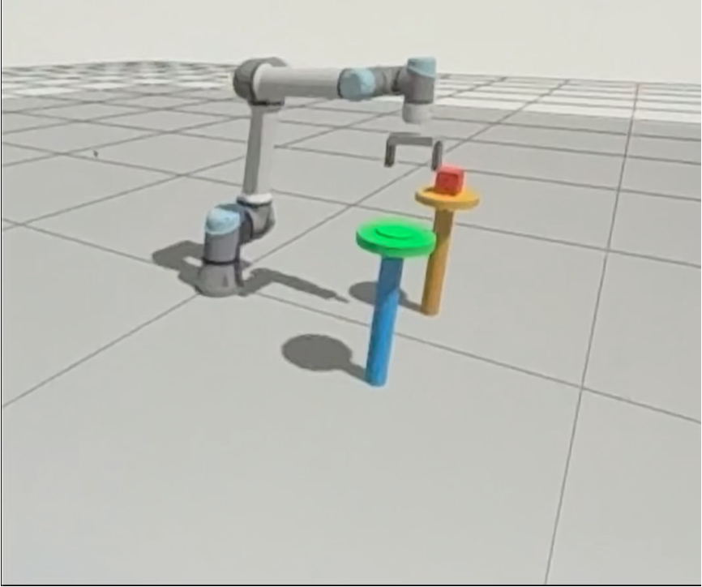

# UR5e RL Pick-and-Place


Reinforcement learning (SAC + HER) for a UR5e arm learning to grasp a cube and place it
on a peg, simulated in **Gazebo Harmonic** under **ROS 2 Jazzy**.

<p align="center">
  
  <br>
  <em>UR5e reaching for the cube (red, on the orange peg) before placing it on the target peg (blue/green) in the Gazebo Harmonic simulation.</em>
</p>

| | |
|---|---|
| **Robot** | Universal Robots UR5e + parallel gripper |
| **Simulator** | Gazebo Harmonic (`ros_gz`) |
| **Middleware** | ROS 2 Jazzy |
| **Algorithm** | SAC + Hindsight Experience Replay (`n_sampled_goal=4`, strategy `future`) |
| **Best result** | ~75% success rate with cube position randomized ±8 cm |

## Project structure

```
.
├── urdf/                   # Robot description (xacro)
├── config/                 # Controllers, joint init state, ROS↔Gazebo topic bridge
├── launch/                 # ROS 2 launch files (simulation bring-up)
├── worlds/                 # Gazebo world (robot, cube, peg)
├── ur5e_rl_gazebo/
│   ├── env.py               # Gymnasium environment (obs, reward, reset, gripper)
│   ├── bridge.py             # ROS 2 ↔ Gazebo interface (topics/services)
│   ├── train.py              # SAC + HER training loop, checkpointing
│   ├── demo.py                # Scripted expert demonstrations
│   └── watch_training.py      # Live dashboard (success rate, reward) from tfevents
├── checkpoints/             # Saved policy checkpoints
├── data/                    # Expert demonstration buffers (for HER warm-start)
└── scripts/guard_train.sh   # Cron watchdog that restarts training if it crashes
```

## Quick start

### 1. Launch the simulation (terminal 1)
```bash
ros2 launch ur5e_rl_gazebo sim.launch.py
```
Starts Gazebo and the robot controllers. Wait for `/clock` to be active before
starting training.

Headless mode (lighter, no GUI):
```bash
GZ_HEADLESS=1 ros2 launch ur5e_rl_gazebo sim.launch.py
```

### 2. Train (terminal 2)
```bash
ros2 run ur5e_rl_gazebo train
```

Resume from a checkpoint:
```bash
RESUME_FROM=checkpoints/sac_her_ur5e_45000_steps.zip ros2 run ur5e_rl_gazebo train
```

### 3. Evaluate a checkpoint
```bash
ros2 run ur5e_rl_gazebo train eval checkpoints/sac_her_ur5e_45000_steps.zip
```

### 4. Live training dashboard (terminal 3, optional)
```bash
python3 ur5e_rl_gazebo/watch_training.py
```
Plots success rate and reward in real time from the tfevents logs.

## Auto-restart watchdog (cron)

`scripts/guard_train.sh` restarts the training stack automatically if it crashes.

```bash
cp scripts/guard_train.sh ~/ros2_ws/
chmod +x ~/ros2_ws/guard_train.sh
crontab -e   # add: * * * * * /home/<user>/ros2_ws/guard_train.sh
```

Disable with:
```bash
crontab -l | grep -v guard_train | crontab -
```

## State of the project (June 2026)

- Algorithm: SAC + `HerReplayBuffer` (`n_sampled_goal=4`, `future`) + 60 scripted demos
  injected into the replay buffer.
- Reward: pure sparse (consistent with HER).
- `randomize_cube=True`: cube spawns within ±8 cm of nominal position at every reset.
- Best result so far: ~75% success rate during training with randomization enabled.
- Next milestone: sim-to-real transfer onto the physical UR5e in the lab.

## Results

The screenshot above shows a typical episode: the arm reaches for the cube (on the
orange peg, pick pose) and must place it on the target peg (blue/green, place pose)
within a tolerance window. Training curves (success rate and episodic reward vs.
timesteps) are logged to
TensorBoard and can be visualized live with `watch_training.py`, or after the fact with:

```bash
tensorboard --logdir ur5e_rl_gazebo/tb_logs/
```

## License

MIT — see [LICENSE](LICENSE).
